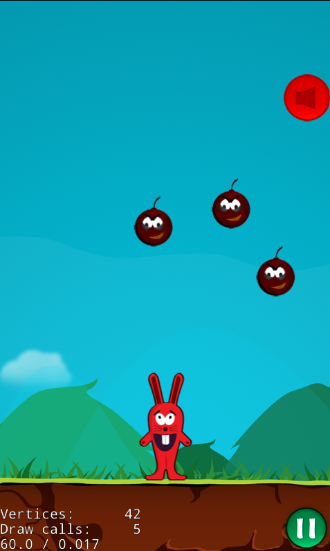

# HappyAxmol

HappyAxmol is the Axmol port of the Cocos2d-x Happy Bunny Game.

This is a cross-platform game built with [Axmol Engine](https://axmol.dev/).

You can run the web build from [here](https://www.raydelto.org/axmol).



## Prerequisites

Before building this project, you need to have the following installed:

- **CMake** 3.22 or newer
- **Axmol Engine** - Download and set up from [https://axmol.dev/](https://axmol.dev/)
- **Platform-specific tools** (see below)

### Setting up Axmol Engine

1. Clone or download the Axmol Engine (https://www.axmol.dev)
2. Run the Axmol setup script contained in the root of the axmol repo.
   - **Windows**: `setup.ps1`
   - **Linux/macOS**: `setup.py`

Alternatively, you can place the `axmol` folder directly in this project directory for an isolated build.

## Building for Different Platforms

### Windows

**Requirements:**
- Visual Studio 2019 or newer with C++ development tools
- CMake 3.22+

**Build Steps:**

Using the provided batch file:
```batch
build.bat
```

Or manually with CMake:
```batch
cmake -S . -B build -G "Visual Studio 17 2022" -A x64
cmake --build build --config Release
```

**Running the game:**
```batch
run.bat
```

When prompted, enter the build configuration (Debug, Release, MinSizeRel, or RelWithDebInfo).

The executable will be located at: `build/bin/HappyAxmol/<BuildConfig>/HappyAxmol.exe`

---

### Linux

**Requirements:**
- GCC 9+ or Clang 10+
- CMake 3.22+
- Development libraries: `libgl1-mesa-dev`, `libglu1-mesa-dev`, `libx11-dev`, `libxrandr-dev`, `libxi-dev`, `libasound2-dev`

**Install dependencies (Ubuntu/Debian):**
```bash
sudo apt-get update
sudo apt-get install -y cmake build-essential libgl1-mesa-dev libglu1-mesa-dev \
    libx11-dev libxrandr-dev libxi-dev libasound2-dev libfontconfig1-dev \
    libcurl4-openssl-dev libgtk-3-dev
```

**Build Steps:**
```bash
cmake -S . -B build -DCMAKE_BUILD_TYPE=Release
cmake --build build --config Release
```

**Running the game:**
```bash
cd build/bin/HappyAxmol
./HappyAxmol
```

---

### macOS

**Requirements:**
- Xcode 13 or newer
- CMake 3.22+
- Command Line Tools for Xcode

**Build Steps:**

Generate Xcode project:
```bash
cmake -S . -B build -G Xcode
```

Build from command line:
```bash
cmake --build build --config Release
```

Or open the generated Xcode project:
```bash
open build/HappyAxmol.xcodeproj
```

**Running the game:**
```bash
open build/bin/HappyAxmol/Release/HappyAxmol.app
```

---

### Web (WASM)

**Requirements:**
- Emscripten SDK (emsdk) - [Installation guide](https://emscripten.org/docs/getting_started/downloads.html)
- Python 3.x
- CMake 3.22+

**Setup Emscripten:**
```bash
# Clone emsdk
git clone https://github.com/emscripten-core/emsdk.git
cd emsdk

# Install and activate the latest SDK
./emsdk install latest
./emsdk activate latest

# Set up environment variables (run this in each new terminal)
source ./emsdk_env.sh  # Linux/macOS
# or
emsdk_env.bat          # Windows
```

**Build Steps:**

Using Axmol CLI (recommended):
```bash
axmol build -p wasm
```

Or manually with CMake:
```bash
emcmake cmake -S . -B build_wasm -DCMAKE_BUILD_TYPE=Release
cmake --build build_wasm
```

**Running the game:**

Start a local web server in the build output directory:
```bash
axmol run -p wasm
```

Then open your browser and navigate to: `http://localhost:8080`

---

## Project Structure

```
HappyAxmol/
├── Source/          # C++ source code
├── Content/         # Game assets (images, sounds, etc.)
├── cmake/           # CMake modules
├── proj.win32/      # Windows platform-specific files
├── proj.linux/      # Linux platform-specific files
├── proj.ios_mac/    # iOS and macOS platform-specific files
├── proj.wasm/       # Web/WASM platform-specific files
├── proj.android/    # Android platform-specific files
├── build/           # Build output (generated)
└── CMakeLists.txt   # Main CMake configuration
```

## Troubleshooting

### "AX_ROOT not found" error
Make sure you've set the `AX_ROOT` environment variable correctly and restarted your terminal/IDE.

### Missing dependencies on Linux
Install all required development libraries using your package manager. The error messages will typically indicate which libraries are missing.

### Emscripten build fails
Ensure you've activated the Emscripten environment in your current terminal session by running `source ./emsdk_env.sh` (or `emsdk_env.bat` on Windows).

## Additional Resources

- [Axmol Engine Documentation](https://axmol.dev/)
- [Axmol GitHub Repository](https://github.com/axmolengine/axmol)
- [CMake Documentation](https://cmake.org/documentation/)
